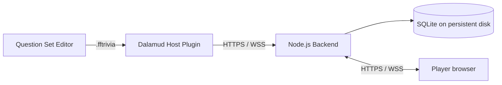

# Mair's Trivia

Mair's Trivia is a hosted trivia platform for Final Fantasy XIV venues. **Kei Joi** maintains the project at [github.com/KeiJoi/mairstrivia](https://github.com/KeiJoi/mairstrivia).

It combines a browser player experience with a Dalamud host interface and a standalone Windows editor. The Node.js backend is always the authority for game state, answer order, scoring, and correctness.

## Components

| Component | What it does |
| --- | --- |
| Node.js backend and player site | Hosts REST/WebSocket game services, SQLite data, and the player join page. |
| Mair's Trivia Dalamud plugin | Lets hosts sign in, manage question sets, create games, preview, send, skip, score, and finish games. |
| Question Set Editor | Creates and validates portable `.fftrivia` question sets on Windows. |

## Install and start

Release downloads are published on the [GitHub Releases page](https://github.com/KeiJoi/mairstrivia/releases). Add this stable custom repository URL in Dalamud’s Experimental settings to make the plugin available in Plugin Installer:

`https://raw.githubusercontent.com/KeiJoi/mairstrivia/main/pluginmaster.json`

Adding the repository makes the plugin discoverable; it does not install it automatically.

- [Server and Render setup](docs/SETUP-SERVER.md)
- [Dalamud plugin setup](docs/SETUP-PLUGIN.md)
- [Question Set Editor setup](docs/SETUP-EDITOR.md)
- [Host guide](docs/HOST-GUIDE.md)
- [Question-set guide](docs/QUESTION-SET-GUIDE.md)
- [Troubleshooting](docs/TROUBLESHOOTING.md)
- [Release process](docs/RELEASING.md)

## Brand

Mair’s Trivia uses orange `#FF5400` for primary actions, neon pink `#FF2BD6` for highlights, and dark surfaces with light text. Correctness is always communicated with text or symbols as well as colour.

## Development

Use Node.js 24 LTS and the .NET SDKs required by the editor/plugin. For backend development, copy `server/.env.example` to a local `.env`, set strong local secrets, then run `npm ci`, `npm run build`, and `npm test` from `server/`. Never commit `.env` files or credentials.
